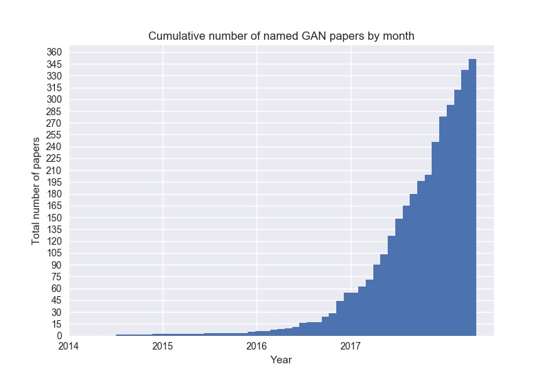

# The GAN Zoo

Every week, new GAN papers are coming out and it's hard to keep track of them all, not to mention the incredibly creative ways in which researchers are naming these GANs! So, here's a list of what started as a fun activity compiling all named GANs!

You can also check out the same data in a tabular format with functionality to filter by year or do a quick search by title [here](https://github.com/hindupuravinash/the-gan-zoo/blob/master/gans.tsv).

Contributions are welcome. Add links through pull requests in gans.tsv file in the same format or create an issue to lemme know something I missed or to start a discussion.

Check out [Deep Hunt](https://deephunt.in) - my weekly AI newsletter for this repo as [blogpost](https://medium.com/deep-hunt/the-gan-zoo-79597dc8c347) and follow me on [Twitter](https://www.twitter.com/hindupuravinash).


* {{ gan['Abbr.'] }} - [{{ gan['Title'] }}]({{ gan['Arxiv'] }})
   
  {#- #} ([github]({{ gan['Official_Code'] }}))
   {# space removed if no github repository #}

  


