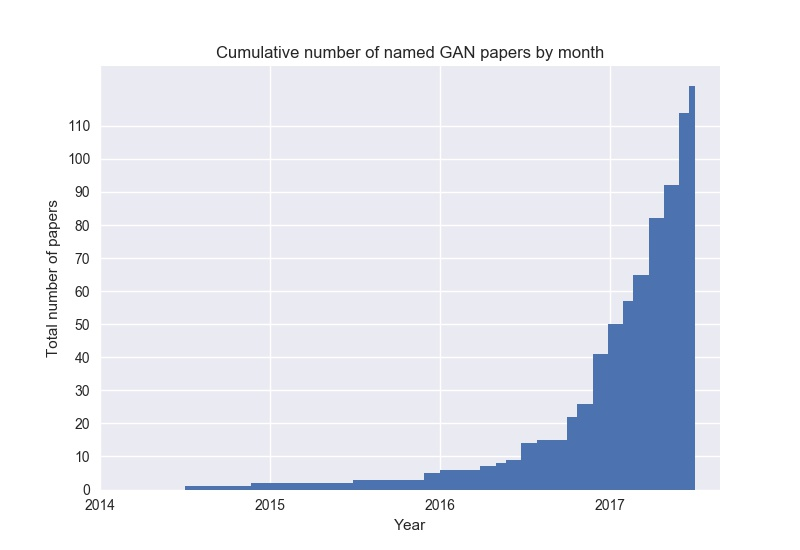

# The GAN Zoo

Every week, new GAN papers are coming out and it's hard to keep track of them all, not to mention the incredibly creative ways in which researchers are naming these GANs! So, here's a list of what started as a fun activity compiling all named GANs!

Contributions are welcome. Add links through pull requests or create an issue to lemme know something I missed or to start a discussion.

Check out [Deep Hunt](https://deephunt.in) - my weekly AI newsletter for this repo as [blogpost](https://medium.com/deep-hunt/the-gan-zoo-79597dc8c347) and follow me on [Twitter](https://www.twitter.com/hindupuravinash).

* GAN - [Generative Adversarial Networks](https://arxiv.org/abs/1406.2661)
* 3D-GAN - [Learning a Probabilistic Latent Space of Object Shapes via 3D Generative-Adversarial Modeling](https://arxiv.org/abs/1610.07584)
* acGAN - [Face Aging With Conditional Generative Adversarial Networks](https://arxiv.org/abs/1702.01983)
* AC-GAN - [Conditional Image Synthesis With Auxiliary Classifier GANs](https://arxiv.org/abs/1610.09585)
* AdaGAN - [AdaGAN: Boosting Generative Models](https://arxiv.org/abs/1701.02386v1)
* AEGAN - [Learning Inverse Mapping by Autoencoder based Generative Adversarial Nets](https://arxiv.org/abs/1703.10094)
* AffGAN - [Amortised MAP Inference for Image Super-resolution](https://arxiv.org/abs/1610.04490)
* AL-CGAN - [Learning to Generate Images of Outdoor Scenes from Attributes and Semantic Layouts](https://arxiv.org/abs/1612.00215)
* ALI - [Adversarially Learned Inference](https://arxiv.org/abs/1606.00704)
* AM-GAN - [Generative Adversarial Nets with Labeled Data by Activation Maximization](https://arxiv.org/abs/1703.02000)
* AnoGAN - [Unsupervised Anomaly Detection with Generative Adversarial Networks to Guide Marker Discovery](https://arxiv.org/abs/1703.05921v1)
* ArtGAN - [ArtGAN: Artwork Synthesis with Conditional Categorial GANs](https://arxiv.org/abs/1702.03410)
* b-GAN - [b-GAN: Unified Framework of Generative Adversarial Networks](https://openreview.net/pdf?id=S1JG13oee)
* Bayesian GAN - [Deep and Hierarchical Implicit Models](https://arxiv.org/abs/1702.08896)
* BEGAN - [BEGAN: Boundary Equilibrium Generative Adversarial Networks](https://arxiv.org/abs/1703.10717v2)
* BiGAN - [Adversarial Feature Learning](https://arxiv.org/abs/1605.09782v7)
* BS-GAN - [Boundary-Seeking Generative Adversarial Networks](https://arxiv.org/abs/1702.08431v1)
* CGAN - [Conditional Generative Adversarial Nets](https://arxiv.org/abs/1411.1784)
* CaloGAN - [CaloGAN: Simulating 3D High Energy Particle Showers in Multi-Layer Electromagnetic Calorimeters with Generative Adversarial Networks](https://arxiv.org/abs/1705.02355)
* CCGAN - [Semi-Supervised Learning with Context-Conditional Generative Adversarial Networks](https://arxiv.org/abs/1611.06430v1)
* CatGAN - [Unsupervised and Semi-supervised Learning with Categorical Generative Adversarial Networks](https://arxiv.org/abs/1511.06390v2)
* CoGAN - [Coupled Generative Adversarial Networks](https://arxiv.org/abs/1606.07536v2)
* Context-RNN-GAN - [Contextual RNN-GANs for Abstract Reasoning Diagram Generation](https://arxiv.org/abs/1609.09444)
* C-RNN-GAN - [C-RNN-GAN: Continuous recurrent neural networks with adversarial training](https://arxiv.org/abs/1611.09904)
* CS-GAN - [Improving Neural Machine Translation with Conditional Sequence Generative Adversarial Nets](https://arxiv.org/abs/1703.04887)
* CVAE-GAN - [CVAE-GAN: Fine-Grained Image Generation through Asymmetric Training](https://arxiv.org/abs/1703.10155)
* CycleGAN - [Unpaired Image-to-Image Translation using Cycle-Consistent Adversarial Networks](https://arxiv.org/abs/1703.10593)
* DTN - [Unsupervised Cross-Domain Image Generation](https://arxiv.org/abs/1611.02200)
* DCGAN - [Unsupervised Representation Learning with Deep Convolutional Generative Adversarial Networks](https://arxiv.org/abs/1511.06434)
* DiscoGAN - [Learning to Discover Cross-Domain Relations with Generative Adversarial Networks](https://arxiv.org/abs/1703.05192v1)
* DR-GAN - [Disentangled Representation Learning GAN for Pose-Invariant Face Recognition](http://cse.msu.edu/~tranluan/publication/allPublication/2017/CVPR_DR_GAN.pdf)
* DualGAN - [DualGAN: Unsupervised Dual Learning for Image-to-Image Translation](https://arxiv.org/abs/1704.02510v1)
* EBGAN - [Energy-based Generative Adversarial Network](https://arxiv.org/abs/1609.03126v4)
* f-GAN - [f-GAN: Training Generative Neural Samplers using Variational Divergence Minimization](https://arxiv.org/abs/1606.00709)
* Flow-GAN [Flow-GAN: Bridging implicit and prescribed learning in generative models](https://arxiv.org/abs/1705.08868)
* FF-GAN - [Towards Large-Pose Face Frontalization in the Wild](https://arxiv.org/abs/1704.06244)
* GAWWN - [Learning What and Where to Draw](https://arxiv.org/abs/1610.02454)
* GeneGAN - [GeneGAN: Learning Object Transfiguration and Attribute Subspace from Unpaired Data](https://arxiv.org/abs/1705.04932)
* Geometric GAN - [Geometric GAN](https://arxiv.org/abs/1705.02894)
* GoGAN - [Gang of GANs: Generative Adversarial Networks with Maximum Margin Ranking](https://arxiv.org/abs/1704.04865)
* GP-GAN - [GP-GAN: Towards Realistic High-Resolution Image Blending](https://arxiv.org/abs/1703.07195v2)
* IAN - [Neural Photo Editing with Introspective Adversarial Networks](https://arxiv.org/abs/1609.07093)
* iGAN - [Generative Visual Manipulation on the Natural Image Manifold](https://arxiv.org/abs/1609.03552v2)
* IcGAN - [Invertible Conditional GANs for image editing](https://arxiv.org/abs/1611.06355)
* ID-CGAN - [Image De-raining Using a Conditional Generative Adversarial Network](https://arxiv.org/abs/1701.05957v3)
* Improved GAN - [Improved Techniques for Training GANs](https://arxiv.org/abs/1606.03498)
* InfoGAN - [InfoGAN: Interpretable Representation Learning by Information Maximizing Generative Adversarial Nets](https://arxiv.org/abs/1606.03657v1)
* LAGAN - [Learning Particle Physics by Example: Location-Aware Generative Adversarial Networks for Physics Synthesis](https://arxiv.org/abs/1701.05927)
* LAPGAN - [Deep Generative Image Models using a Laplacian Pyramid of Adversarial Networks](https://arxiv.org/abs/1506.05751)
* LR-GAN - [LR-GAN: Layered Recursive Generative Adversarial Networks for Image Generation](https://arxiv.org/abs/1703.01560v1)
* LSGAN - [Least Squares Generative Adversarial Networks](https://arxiv.org/abs/1611.04076v3)
* LS-GAN - [Loss-Sensitive Generative Adversarial Networks on Lipschitz Densities](https://arxiv.org/abs/1701.06264v5)
* MGAN - [Precomputed Real-Time Texture Synthesis with Markovian Generative Adversarial Networks](https://arxiv.org/abs/1604.04382)
* MAGAN - [MAGAN: Margin Adaptation for Generative Adversarial Networks](https://arxiv.org/abs/1704.03817v1)
* MAD-GAN - [Multi-Agent Diverse Generative Adversarial Networks](https://arxiv.org/abs/1704.02906)
* MalGAN - [Generating Adversarial Malware Examples for Black-Box Attacks Based on GAN](https://arxiv.org/abs/1702.05983v1)
* MaliGAN - [Maximum-Likelihood Augmented Discrete Generative Adversarial Networks](https://arxiv.org/abs/1702.07983)
* MARTA-GAN - [Deep Unsupervised Representation Learning for Remote Sensing Images](https://arxiv.org/abs/1612.08879)
* McGAN - [McGan: Mean and Covariance Feature Matching GAN](https://arxiv.org/abs/1702.08398v1)
* MDGAN - [Mode Regularized Generative Adversarial Networks](https://arxiv.org/abs/1612.02136)
* MedGAN - [Generating Multi-label Discrete Electronic Health Records using Generative Adversarial Networks](https://arxiv.org/abs/1703.06490v1)
* MIX+GAN - [Generalization and Equilibrium in Generative Adversarial Nets (GANs)](https://arxiv.org/abs/1703.00573v3)
* MPM-GAN - [Message Passing Multi-Agent GANs](https://arxiv.org/abs/1612.01294)
* MV-BiGAN - [Multi-view Generative Adversarial Networks](https://arxiv.org/abs/1611.02019v1)
* pix2pix - [Image-to-Image Translation with Conditional Adversarial Networks](https://arxiv.org/abs/1611.07004)
* PPGN - [Plug & Play Generative Networks: Conditional Iterative Generation of Images in Latent Space](https://arxiv.org/abs/1612.00005)
* Pose-GAN - [The Pose Knows: Video Forecasting by Generating Pose Futures](https://arxiv.org/abs/1705.00053)
* PrGAN - [3D Shape Induction from 2D Views of Multiple Objects](https://arxiv.org/abs/1612.05872)
* RenderGAN - [RenderGAN: Generating Realistic Labeled Data](https://arxiv.org/abs/1611.01331)
* RTT-GAN - [Recurrent Topic-Transition GAN for Visual Paragraph Generation](https://arxiv.org/abs/1703.07022v2)
* SGAN - [Stacked Generative Adversarial Networks](https://arxiv.org/abs/1612.04357v4)
* SGAN - [Texture Synthesis with Spatial Generative Adversarial Networks](https://arxiv.org/abs/1611.08207)
* SAD-GAN - [SAD-GAN: Synthetic Autonomous Driving using Generative Adversarial Networks](https://arxiv.org/abs/1611.08788v1)
* SalGAN - [SalGAN: Visual Saliency Prediction with Generative Adversarial Networks](https://arxiv.org/abs/1701.01081v2)
* SEGAN - [SEGAN: Speech Enhancement Generative Adversarial Network](https://arxiv.org/abs/1703.09452v1)
* SeGAN - [SeGAN: Segmenting and Generating the Invisible](https://arxiv.org/abs/1703.10239)
* SeqGAN - [SeqGAN: Sequence Generative Adversarial Nets with Policy Gradient](https://arxiv.org/abs/1609.05473v5)
* SimGAN - [Learning from Simulated and Unsupervised Images through Adversarial Training](https://arxiv.org/abs/1612.07828)
* SketchGAN - [Adversarial Training For Sketch Retrieval](https://arxiv.org/abs/1607.02748)
* SL-GAN - [Semi-Latent GAN: Learning to generate and modify facial images from attributes](https://arxiv.org/abs/1704.02166)
* Softmax-GAN - [Softmax GAN](https://arxiv.org/abs/1704.06191)
* SRGAN - [Photo-Realistic Single Image Super-Resolution Using a Generative Adversarial Network](https://arxiv.org/abs/1609.04802v3)
* S^2GAN - [Generative Image Modeling using Style and Structure Adversarial Networks](https://arxiv.org/abs/1603.05631v2)
* SSL-GAN - [Semi-Supervised Learning with Context-Conditional Generative Adversarial Networks](https://arxiv.org/abs/1611.06430v1)
* StackGAN - [StackGAN: Text to Photo-realistic Image Synthesis with Stacked Generative Adversarial Networks](https://arxiv.org/abs/1612.03242v1)
* TGAN - [Temporal Generative Adversarial Nets](https://arxiv.org/abs/1611.06624v1)
* TAC-GAN - [TAC-GAN - Text Conditioned Auxiliary Classifier Generative Adversarial Network](https://arxiv.org/abs/1703.06412v2)
* TP-GAN - [Beyond Face Rotation: Global and Local Perception GAN for Photorealistic and Identity Preserving Frontal View Synthesis](https://arxiv.org/abs/1704.04086)
* Triple-GAN - [Triple Generative Adversarial Nets](https://arxiv.org/abs/1703.02291v2)
* Unrolled GAN - [Unrolled Generative Adversarial Networks](https://arxiv.org/abs/1611.02163)
* VGAN - [Generating Videos with Scene Dynamics](https://arxiv.org/abs/1609.02612)
* VGAN - [Generative Adversarial Networks as Variational Training of Energy Based Models](https://arxiv.org/abs/1611.01799)
* VAE-GAN - [Autoencoding beyond pixels using a learned similarity metric](https://arxiv.org/abs/1512.09300)
* VariGAN - [Multi-View Image Generation from a Single-View](https://arxiv.org/abs/1704.04886)
* ViGAN - [Image Generation and Editing with Variational Info Generative Adversarial Networks](https://arxiv.org/abs/1701.04568v1)
* WGAN - [Wasserstein GAN](https://arxiv.org/abs/1701.07875v2)
* WGAN-GP - [Improved Training of Wasserstein GANs](https://arxiv.org/abs/1704.00028)
* WaterGAN - [WaterGAN: Unsupervised Generative Network to Enable Real-time Color Correction of Monocular Underwater Images](https://arxiv.org/abs/1702.07392v1)
